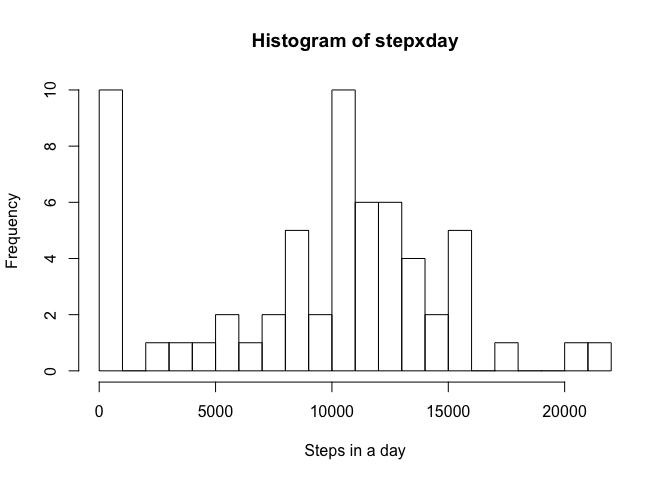
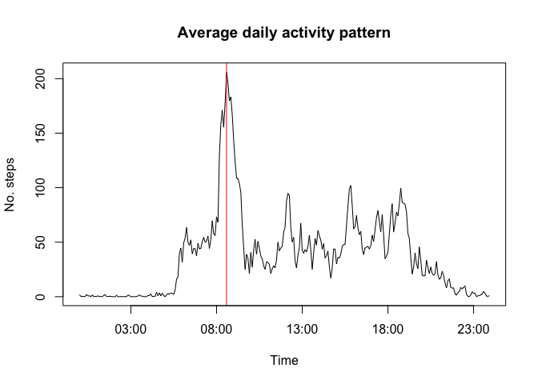
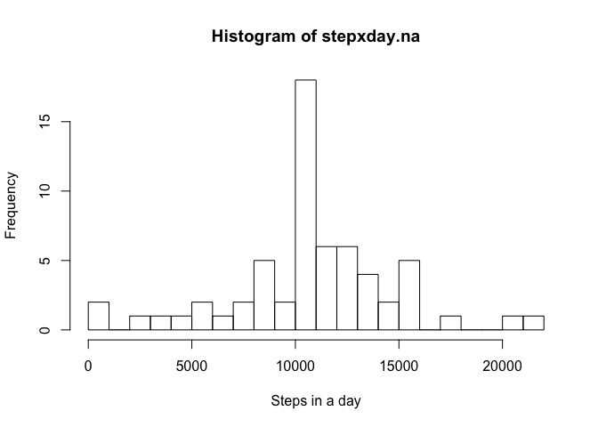
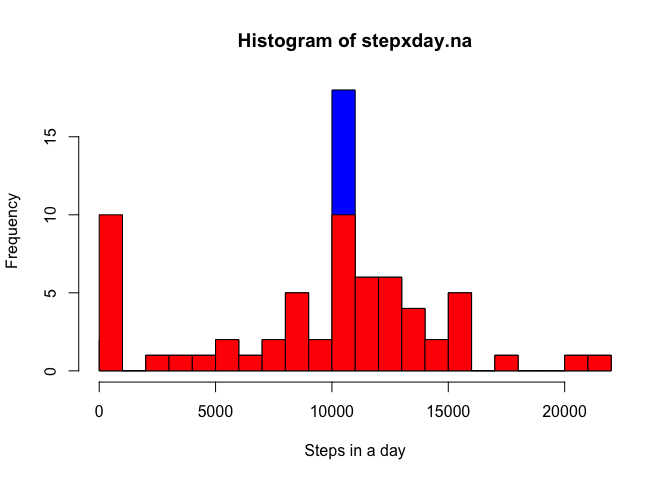
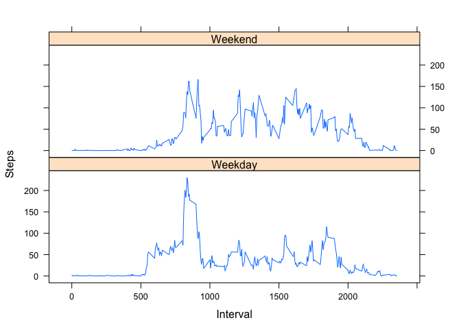

# Reproducible Research: Peer Assessment 1

Set the required library for this assignment.

```r
# Load the knitr library to set globals:
require(knitr)
```

```
## Loading required package: knitr
```

```r
require(lattice)
```

```
## Loading required package: lattice
```

Set the general options for this assignment.

```r
opts_chunk$set(echo = TRUE)
```

## Loading and preprocessing the data

Unzip the data and load the dataframe.

```r
unzip("activity.zip")

activity <- read.csv("activity.csv")
```

Inspect the first lines of the dataframe.

```r
head(activity,5)
```

```
##   steps       date interval
## 1    NA 2012-10-01        0
## 2    NA 2012-10-01        5
## 3    NA 2012-10-01       10
## 4    NA 2012-10-01       15
## 5    NA 2012-10-01       20
```

## What is mean total number of steps taken per day?

Analyse the frequency of steps per day of the user does.
The days where the values are missing are disregarded.

```r
stepxday <- tapply(activity$steps,activity$date,sum,na.rm=T)

hist(stepxday, xlab = "Steps in a day", breaks = 30)
```

<!-- -->

Compute and report the median and the mean of the steps per day.

```r
medianstepxday <- median(stepxday)

meanstepxday <- mean(stepxday)
```

The median results being 10395.  
The calculated mean is 9354.2295082.

## What is the average daily activity pattern?

Group the measurements by their interval.

```r
stepxinterval <- aggregate(steps ~ interval, activity, mean)

str(stepxinterval)
```

```
## 'data.frame':	288 obs. of  2 variables:
##  $ interval: int  0 5 10 15 20 25 30 35 40 45 ...
##  $ steps   : num  1.717 0.3396 0.1321 0.1509 0.0755 ...
```

Transform the interval variable into a time variable.

```r
stepxinterval$time <- formatC(stepxinterval$interval, width = 4, format = "d", flag = "0")
stepxinterval$time <- strptime(stepxinterval$time, format = "%H%M")

str(stepxinterval)
```

```
## 'data.frame':	288 obs. of  3 variables:
##  $ interval: int  0 5 10 15 20 25 30 35 40 45 ...
##  $ steps   : num  1.717 0.3396 0.1321 0.1509 0.0755 ...
##  $ time    : POSIXlt, format: "2017-06-04 00:00:00" "2017-06-04 00:05:00" ...
```

Find the 5 minutes interval presenting the highest average value.
Analyse the average steps per interval that the user does during the day. The plot presents also the highest mean value.

```r
maxstepxinterval <- max(stepxinterval$steps)
maxstepxinterval_time <- stepxinterval$time[which(stepxinterval$steps == maxstepxinterval)]

 p = plot(y=stepxinterval$steps, x=stepxinterval$time,
     ylab = "No. steps", xlab = "Time",
     main = "Average daily activity pattern", type="l") +
  abline(v=as.numeric(as.POSIXlt(maxstepxinterval_time)),col="red")
```

<!-- -->

The time of the day with the highest average amount of steps is 08:35.

## Imputing missing values

The dataset comes with several missing values.

```r
sum(is.na(activity$steps))
```

```
## [1] 2304
```

Sometimes is required to get rid of the missing values. To do that the NA value can be disregarded and an average value taken. NAs will be filled with the average value of the measurements taken in that interval of time.

```r
activity.na<- transform(activity, steps = ifelse(is.na(activity$steps), stepxinterval$steps, activity$steps))

sum(is.na(activity.na$steps))
```

```
## [1] 0
```

Calculate the total number of steps taken per day with our new data frame:

```r
stepxday.na <- tapply(activity.na$steps,activity.na$date,sum)

hist(stepxday.na, xlab = "Steps in a day", breaks = 30)
```

<!-- -->

Compute and report the median and the mean of the steps per day.

```r
medianstepxday.na <- median(stepxday.na)

meanstepxday.na <- mean(stepxday.na)
```

The median results being 1.0766189\times 10^{4}.  
The calculated mean is 1.0766189\times 10^{4}.

We notice that:

* The mean calculated with the original values is the same as the mean calculated with the data containing NA values,

* The median calculated of the original values is slightly higher than the median calculated with the data containing NA values,

* The mean and the median are now equal.


```r
h = hist(stepxday.na, xlab = "Steps in a day", breaks = 30, col = "blue")
  hist(stepxday, breaks = 30, add = T, col = "red")
```

<!-- -->

By removing the NA values the total number of steps increases.

## Are there differences in activity patterns between weekdays and weekends?

An interesting question, is th user behaviour depending on the day of the week? Is there any relevant difference between weekday and weekend?
The next step is to divide the dataset in these two subgroups.

```r
activity.na$weekday <- weekdays(as.Date(activity.na$date))

activity.na$is.weekend <- grepl("^S",activity.na$weekday)
activity.na$Type <- factor(activity.na$is.weekend, levels = c(F, T), labels = c("Weekday", "Weekend"))

str(activity.na)
```

```
## 'data.frame':	17568 obs. of  6 variables:
##  $ steps     : num  1.717 0.3396 0.1321 0.1509 0.0755 ...
##  $ date      : Factor w/ 61 levels "2012-10-01","2012-10-02",..: 1 1 1 1 1 1 1 1 1 1 ...
##  $ interval  : int  0 5 10 15 20 25 30 35 40 45 ...
##  $ weekday   : chr  "Monday" "Monday" "Monday" "Monday" ...
##  $ is.weekend: logi  FALSE FALSE FALSE FALSE FALSE FALSE ...
##  $ Type      : Factor w/ 2 levels "Weekday","Weekend": 1 1 1 1 1 1 1 1 1 1 ...
```

Now that we have the column weekend, we are able to separate the variable steps in two subgroups

```r
stepxinterval.Type <- aggregate(steps ~ interval + Type, activity.na, mean)
```

As it was done before, transform the interval variable into a time variable.

```r
stepxinterval.Type$time <- formatC(stepxinterval.Type$interval, width = 4, format = "d", flag = "0")
stepxinterval.Type$time <- strptime(stepxinterval.Type$time, format = "%H%M")
```


```r
xyplot(steps ~ interval | Type, data = stepxinterval.Type,
       layout = c(1,2), type ="l", xlab = "Interval", ylab = "Steps")
```

<!-- -->

By looking at the graph is possible to say that there is a difference between weekdays and weekends. The main conclusion that can be drawn by the comparison is that the user on average around interval 800 is walking more during the weekdays than during the weekend.
